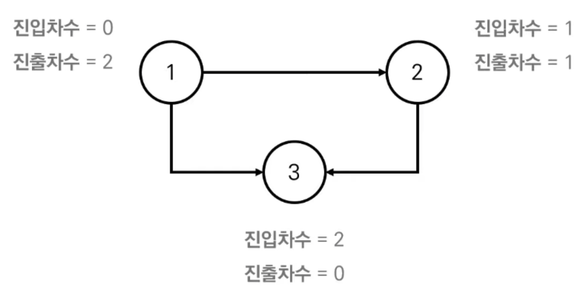

[1. 위상 정렬](#위상-정렬)

---

### 위상 정렬

- 사이클이 없는 방향 그래프의 모든 노드를 **방향성에 거스르지 않도록 순서대로 나열**하는 것

- 진입차수(Indegree) : 특정한 노드로 들어오는 간선 개수<br>

  진출차수(Outdegree) : 특정한 노드에서 나가는 간선의 개수

  

```python
from collections import deque

# graph	: 방향 그래프의 간선 방향
# indegree : 각 정점의 진입 차수

def topology_sort():
  result = []	# 알고리즘 수행 결과를 담을 리스트
  q = deque()
  
	# 1. 진입차수가 0인 모든 노드를 큐에 넣는다.
	for i in range(1, V+1):
    if indegree[i] == 0:
      q.append(i)
      
  # 2. 큐가 빌 때 까지 다음을 반복한다.
  while q:  
		# 2-1. 큐에서 원소를 꺼내 
		now = q.popleft()
    result.append(now)
    
    # 2-2. 해당 노드에서 나가는 간선을 그래프에서 제거한다.
		for i in graph[now]:
      indegree[i] -= 1
      
    	# 2-3. 새롭게 진입차수가 0이 된 노드를 큐에 넣는다.
      if indegree[i] == 0:
        q.append(i)
```

